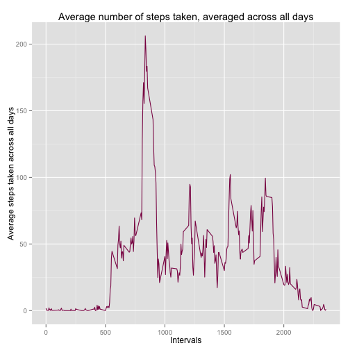

## Loading and preprocessing the data

```r
dataframe <- read.csv("activity.csv", colClasses = c("integer", "Date", "factor"))
df_noNA <- na.omit(dataframe)
df_noNA$month <- as.numeric(format(df_noNA$date, "%m"))
```

## Make a histogram of the total number of steps taken each day


```r
totalStepsPerDay <- aggregate(steps ~ date, data = df_noNA, sum)
hist(totalStepsPerDay$steps)
```

 

##mean of total number of steps taken per day


```r
mean(totalStepsPerDay$steps)
```

```
## [1] 10766.19
```

##median of total number of steps taken per day


```r
median(totalStepsPerDay$steps)
```

```
## [1] 10765
```

##What is the average daily activity pattern?


```r
library(ggplot2)
avgStepsPerInterval <- aggregate(df_noNA$steps, list(Interval = as.numeric(as.character(df_noNA$interval))), FUN = mean)
colnames(avgStepsPerInterval) <- c("Interval", "AvgSteps")
ggplot(avgStepsPerInterval, aes(x = Interval, y = AvgSteps)) + geom_line(color = "deeppink4",width = 0.6) + labs(title = "Average number of steps taken, averaged across all days", x = "Intervals" , y = "Average steps taken across all days")
```

 

##Which 5-minute interval, on average across all the days in the dataset, contains the maximum number of steps?


```r
avgStepsPerInterval[which.max(avgStepsPerInterval$AvgSteps),]
```

```
##     Interval AvgSteps
## 104      835 206.1698
```

##Imputing missing values

####1.Calculate and report the total number of missing values in the dataset

```r
sum(is.na(dataframe))
```

```
## [1] 2304
```

####2.Devise a strategy for filling in all of the missing values in the dataset. The strategy does not need to be sophisticated. For example, you could use the mean/median for that day, or the mean for that 5-minute interval, etc.

#####The Strategy that I used is by replacing NA values with mean for that 5-minute interval

```r
# medianStepsPerDay <- aggregate(steps ~ date, data = df_noNA, FUN = mean)
# head(medianStepsPerDay,n=20)
library(plyr)
newDataFrame <- dataframe
for (i in 1: nrow(newDataFrame)){
  if (is.na(newDataFrame$steps[i])){
    intervalAffected <- newDataFrame$interval[i]
    newDataFrame$steps[i] <- avgStepsPerInterval[which(intervalAffected == avgStepsPerInterval$Interval),]$AvgSteps
  }
}

# newDataFrame
sum(is.na(newDataFrame))
```

```
## [1] 0
```

####4.Make a histogram of the total number of steps taken each day.


```r
totalStepsPerDayAll <- aggregate(steps ~ date, data = newDataFrame, sum)
hist(totalStepsPerDayAll$steps)
```

 

####5. Calculate and report the mean and median total number of steps taken per day.


```r
mean(totalStepsPerDay$steps)
```

```
## [1] 10766.19
```

```r
mean(totalStepsPerDayAll$steps)
```

```
## [1] 10766.19
```

```r
median(totalStepsPerDay$steps)
```

```
## [1] 10765
```

```r
median(totalStepsPerDayAll$steps)
```

```
## [1] 10766.19
```

####We can observed that the mean remains the same but the median has increased. 
## Are there differences in activity patterns between weekdays and weekends?
* Create a new factor variable in the dataset with two levels – “weekday” and “weekend” indicating whether a given date is a weekday or weekend day.


```r
newDataFrame$day <- factor(weekdays(newDataFrame$date))
levels(newDataFrame$day) <- list( weekday = c("Monday", "Tuesday" , "Wednesday", "Thursday", "Friday"),
                                  weekend = c("Saturday", "Sunday"))
levels(newDataFrame$day)
```

```
## [1] "weekday" "weekend"
```
* Make a panel plot containing a time series plot (i.e. type = "l") of the 5-minute interval (x-axis) and the average number of steps taken, averaged across all weekday days or weekend days (y-axis).

```r
avgStepsPerIntervalFull <- aggregate(newDataFrame$steps, list(Intervals = as.numeric(as.character(newDataFrame$interval)),
                                                              day = newDataFrame$day), FUN = "mean")
names(avgStepsPerIntervalFull)[3] <- "meanSteps"
library(lattice) 
xyplot(avgStepsPerIntervalFull$meanSteps ~ avgStepsPerIntervalFull$Intervals | avgStepsPerIntervalFull$day, type = "l",
       xlab = "Interval", ylab = "Number of steps", layout = c(1,2))
```

 


